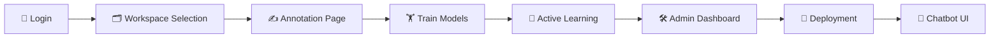

# 🤖 NLU Training Platform + Rasa Chatbot

<div align="center">


**A complete end-to-end system for NLU annotation, active learning, model training, workspace management, and chatbot interaction.**

[Features](#-features) • [Installation](#-installation) • [Usage](#-project-workflow) • [API](#-api-endpoints) • [Contributing](#-future-enhancements)

</div>

---

## 🎯 Overview

A production-ready platform that combines **Flask**, **Rasa NLU**, and **spaCy** to deliver a complete Natural Language Understanding pipeline. This system enables you to:

- 🏗️ **Build**: Annotate training data with an intuitive web interface
- 🧠 **Train**: Deploy Rasa and spaCy models with version control
- 📊 **Monitor**: Track model performance through an admin dashboard
- 🔄 **Improve**: Leverage active learning to enhance dataset quality
- 💬 **Deploy**: Interact with your chatbot through a custom UI

### 🔧 Tech Stack

| Component | Technology |
|-----------|-----------|
| Backend API | Flask |
| NLU Engine | Rasa NLU |
| Entity Recognition | spaCy |
| Authentication | JWT |
| Active Learning | Custom Algorithm |
| Frontend | HTML, CSS, JavaScript |

### 🚀 Workflow Pipeline

```
📝 Annotate → 🏋️ Train → 📈 Review → 🔄 Retrain → 🚀 Deploy → 💬 Chat
```

---

## 📌 Table of Contents

- [Features](#-features)
- [Project Workflow](#-project-workflow)
- [Project Structure](#-project-structure)
- [Installation](#-installation)
- [API Endpoints](#-api-endpoints)
- [Future Enhancements](#-future-enhancements)
- [License](#-license)

---

## ✨ Features

### 1. 🔐 Authentication (JWT-Based)

- ✅ User registration & login
- ✅ Secure JWT tokens
- ✅ Redirects to login if unauthenticated
- ✅ Automatic session validation

### 2. 🗂️ Workspace Management

Each workspace stores its own isolated data:

- 📄 Training dataset
- 🤖 Trained model versions
- 📊 Metadata history
- 🔍 Uncertain samples for active learning

> **Multi-project support**: Manage multiple NLU projects independently!

### 3. ✍️ Annotation Tool

A full-featured annotation interface:

- 📝 Enter text
- 🎯 Add intent labels
- 🏷️ Add entity spans with `[text](ENTITY)` syntax
- 👁️ Preview JSON format
- 💾 Save annotations to selected workspace

**Example annotation format:**
```json
{
  "text": "Book a table at Leela Palace",
  "intent": "book_restaurant",
  "entities": [
    { "start": 17, "end": 29, "label": "RESTAURANT" }
  ]
}
```

### 4. 🤖 Model Training

#### spaCy NER
- Custom entity training
- Models stored under `models/spacy_model/`

#### Rasa NLU
- Converts annotations → `nlu.yml`
- Runs `rasa train nlu`
- Saves `.tar.gz` model files
- Generates metadata per version

### 5. 🔁 Active Learning Module

Intelligent model improvement:

- 🎯 Detects low-confidence predictions (< 0.6)
- 💾 Stores them in `uncertain_samples.json`
- ✏️ Allows user to re-annotate and retrain
- 🔄 Integrates seamlessly with existing training pipeline

> **Smart Learning**: Active learning improves your dataset automatically over time!

### 6. 🛠️ Admin Dashboard

Comprehensive project overview:

| Metric | Description |
|--------|-------------|
| 📊 Total Annotations | Number of labeled samples |
| 🏷️ Entity Types | Unique entity labels |
| 🎯 Intent List | All intent categories |
| 🤖 Model Versions | Training history |
| ⏰ Last Trained | Most recent model update |
| 👥 User Accounts | Registered users |

**Quick Actions:**
- 🔄 Retrain spaCy
- 🔄 Retrain Rasa
- 🔄 Retrain both models
- 🎓 Open Active Learning module

### 7. 🚀 Deployment Pipeline UI

Visual representation of deployment stages:

```
🐳 Docker Build → 📦 Container Registry → ☁️ Cloud Deploy → 🌐 Live Service
```

> *All buttons are placeholders for future CI/CD integration.*

### 8. 🛒 Custom Chatbot UI (E-commerce)

Interactive chat interface with:

- 💬 Real-time chat interface
- 📦 Order-tracking intent
- 🛍️ Product suggestion intents
- 🤷 Fallback handling

**Example conversation:**
```
You: show me laptops  
Bot: Here are trending laptops right now...
```

---

## 🔄 Project Workflow



---

## 📁 Project Structure

```
Annotation-and-ChatBot-Training-/
├── 🛠️ nlu-annotation-tool/
│   ├── 🔧 backend/
│   │   ├── app.py
│   │   ├── auth/
│   │   │   └── jwt_utils.py
│   │   ├── api_blueprints/
│   │   │   ├── auth_api.py
│   │   │   ├── workspace_api.py
│   │   │   ├── models_api.py
│   │   │   ├── train_api.py
│   │   │   └── admin_api.py
│   │   ├── utils/
│   │   │   ├── model_utils.py
│   │   │   ├── tokenizer.py
│   │   │   └── active_learning.py
│   │   ├── data/
│   │   │   └── uncertain_samples.json
│   │   └── workspaces/
│   │
│   ├── 🎨 frontend/
│   │   ├── auth.html
│   │   ├── workspace.html
│   │   ├── landing.html
│   │   ├── active_learning.html
│   │   ├── admin_dashboard.html
│   │   ├── deployment.html
│   │   └── style.css
│   │
│   ├── data/
│   │   └── nlu.yml
│   └── requirements.txt
│
├── 🤖 models/
│   ├── metadata/
│   ├── spacy_models/
│   └── rasa_models/
│
├── 📄 domain.yml
├── 📄 config.yml
├── 📝 README.md
└── 📋 requirements.txt
```

---

## 🚀 Installation

### Prerequisites

- Python 3.8+
- pip
- Virtual environment (recommended)

### Setup Steps

#### 1️⃣ Clone Repository
```bash
git clone https://github.com/n1hal06/Annotation-and-ChatBot-Training-.git
cd Annotation-and-ChatBot-Training-
```

#### 2️⃣ Create Virtual Environment
```bash
# macOS/Linux
python -m venv venv
source venv/bin/activate

# Windows
python -m venv venv
venv\Scripts\activate
```

#### 3️⃣ Install Dependencies
```bash
pip install -r requirements.txt
```

#### 4️⃣ Start Backend
```bash
python nlu-annotation-tool/backend/app.py
```

#### 5️⃣ Access Frontend

Open your browser and navigate to:
```
http://localhost:5000
```

Or use a Live Server extension for development.

---

## 🔌 API Endpoints

### 🔐 Authentication
| Method | Endpoint | Description |
|--------|----------|-------------|
| POST | `/api/auth/register` | Register new user |
| POST | `/api/auth/login` | User login |
| GET | `/api/auth/users` | List all users |

### ✍️ Annotation
| Method | Endpoint | Description |
|--------|----------|-------------|
| POST | `/api/annotations` | Save new annotation |
| GET | `/api/annotations?workspace_id=` | Get workspace annotations |

### 🤖 Model Training
| Method | Endpoint | Description |
|--------|----------|-------------|
| POST | `/api/train` | Train model (`{"backend": "spacy" \| "rasa"}`) |

### 🔁 Active Learning
| Method | Endpoint | Description |
|--------|----------|-------------|
| GET | `/api/active_learning/uncertain_samples` | Get uncertain predictions |
| POST | `/api/active_learning/retrain` | Retrain with corrected samples |

### 🛠️ Admin
| Method | Endpoint | Description |
|--------|----------|-------------|
| GET | `/api/admin/stats` | Get workspace statistics |
| GET | `/api/admin/users` | Get user list |
| GET | `/api/admin/model_health` | Get model health metrics |

---

## 🔮 Future Enhancements

- [ ] 🐳 Live deployment to Docker Hub + Render
- [ ] 🔄 Real-time chatbot model switching
- [ ] 🎯 Automatic confidence threshold tuning
- [ ] 👥 Multi-user collaboration inside workspace
- [ ] 📊 Advanced analytics and visualizations
- [ ] 🌐 Multi-language support
- [ ] 🔗 Integration with popular messaging platforms

---

## 📄 License

This project is licensed under the **MIT License**.

---

<div align="center">

**Made with ❤️ for the NLU Community**

⭐ Star this repo if you find it useful!

[Report Bug](https://github.com/n1hal06/Annotation-and-ChatBot-Training-/issues) • [Request Feature](https://github.com/n1hal06/Annotation-and-ChatBot-Training-/issues)

</div>
